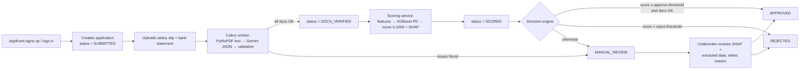
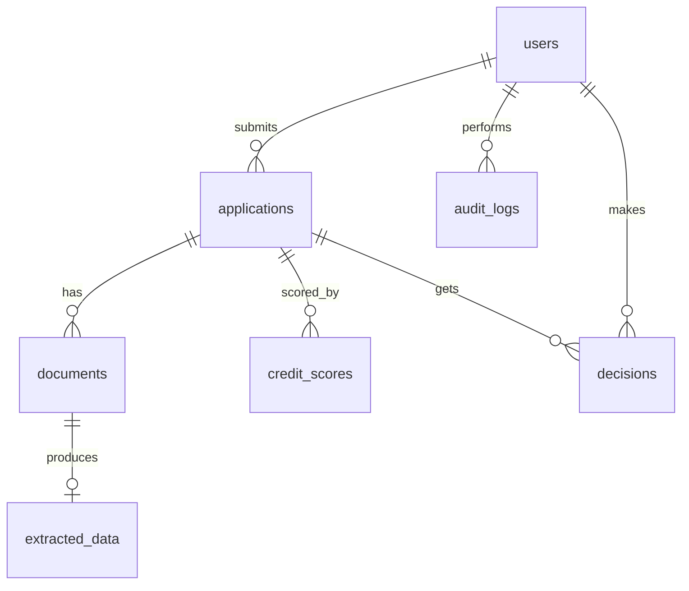
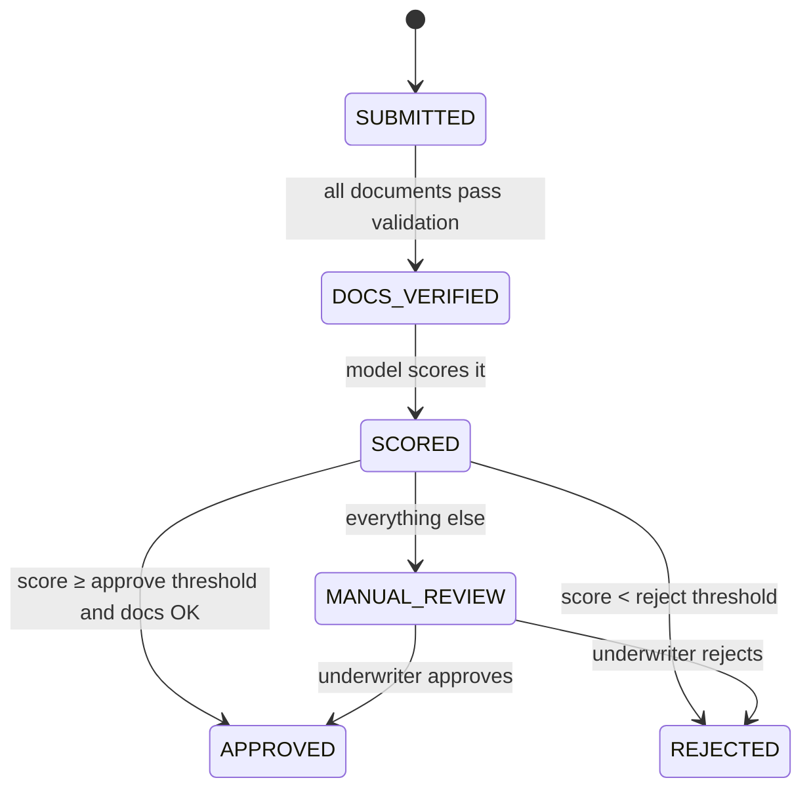

# CredScorer: system design

## 1. Main flow

Every state change, login, threshold change and manual decision writes a row to `audit_logs`.

## 2. Roles

| Role | Can do |
|---|---|
| `applicant` | Create and view **only their own** applications, upload documents, see score, reasons, what-if |
| `underwriter` | View the manual review queue, see all application details, approve/reject with a reason |
| `admin` | Everything an underwriter can, plus manage users, edit thresholds, view stats and audit logs |

## 3. Database tables

### users
| Column | Type | Notes |
|---|---|---|
| id | int PK | |
| email | varchar(255) | unique, indexed |
| password_hash | varchar | argon2 hash, never the raw password |
| full_name | varchar | used to cross-check names on documents |
| role | varchar(20) | applicant / underwriter / admin |
| created_at | timestamp | |

### applications
| Column | Type | Notes |
|---|---|---|
| id | int PK | |
| user_id | FK → users | indexed |
| amount_requested | numeric(14,2) | |
| term_months | int | |
| purpose | varchar | |
| declared_monthly_income | numeric(14,2) | what the applicant typed, compared with the salary slip |
| employment_type | varchar | salaried / self-employed / other |
| employment_years | float | |
| status | varchar(20) | see section 4, indexed |
| created_at, updated_at | timestamp | |

### documents
| Column | Type | Notes |
|---|---|---|
| id | int PK | |
| application_id | FK → applications | |
| doc_type | varchar | salary_slip / bank_statement |
| file_path | varchar | server-generated name, never the user's filename |
| mime_type | varchar | PDF only |
| extraction_status | varchar | PENDING / DONE / FAILED |
| uploaded_at | timestamp | |

### extracted_data
| Column | Type | Notes |
|---|---|---|
| id | int PK | |
| document_id | FK → documents, unique | one extraction per document |
| payload | JSONB | Gemini output (salary, employer, monthly balances) |
| confidence | float | 0 to 1 from validation rules |
| issues | JSONB | e.g. "declared income differs from slip by 22%" |
| model_name | varchar | which LLM produced it |
| created_at | timestamp | |

### credit_scores
| Column | Type | Notes |
|---|---|---|
| id | int PK | |
| application_id | FK → applications | many rows allowed (re-scoring) |
| pd | float | calibrated probability of default |
| score | int | 0 to 1000 |
| model_version | varchar | which model produced it |
| features | JSONB | exact inputs used, for reproducibility |
| shap_reasons | JSONB | top factors with impact |
| created_at | timestamp | |

### decisions
| Column | Type | Notes |
|---|---|---|
| id | int PK | |
| application_id | FK → applications | |
| outcome | varchar | APPROVED / REJECTED / MANUAL_REVIEW |
| decided_by | FK → users, nullable | null = automatic decision |
| reason | text | required for manual decisions |
| created_at | timestamp | |

### audit_logs (append-only)
| Column | Type | Notes |
|---|---|---|
| id | int PK | |
| actor_id | FK → users, nullable | null = system |
| action | varchar | e.g. STATUS_CHANGE, LOGIN, THRESHOLD_UPDATE |
| entity_type | varchar | application / user / settings |
| entity_id | int | |
| before | JSONB | |
| after | JSONB | |
| created_at | timestamp | |

### settings
| Column | Type | Notes |
|---|---|---|
| key | varchar PK | e.g. decision_thresholds |
| value | JSONB | e.g. {"approve_min_score": 620, "reject_max_score": 450} |

## 4. Application status flow

Any other transition is rejected in code (`applications/status.py`).

## 5. Design decisions (interview talking points)

1. **Scores are never overwritten.** Each scoring run is a new `credit_scores` row with `model_version` and the exact `features`, so any past decision can be reproduced and explained.
2. **Audit log is append-only.** No update or delete endpoint exists for it. Banks need to show who did what and when.
3. **Declared vs extracted data are stored separately.** That makes income mismatches visible to underwriters instead of silently overwriting what the applicant said.
4. **Document extraction is asynchronous (Celery).** LLM calls take seconds and can fail; the upload API returns immediately and the worker retries.
5. **The model is loaded once at startup**, not per request, so scoring takes milliseconds.
6. **Thresholds live in the database**, not in code, so admins can tune them without a redeploy. They are chosen from the score distribution, not guessed.
7. **Applicants get 404, not 403, for other people's applications**, so they can't discover which IDs exist.
8. **Thin-file applicants are first-class.** Missing credit history is passed as NaN to XGBoost, which handles it natively, instead of rejecting the applicant.
9. **No protected attributes (e.g. gender) as model features.**
