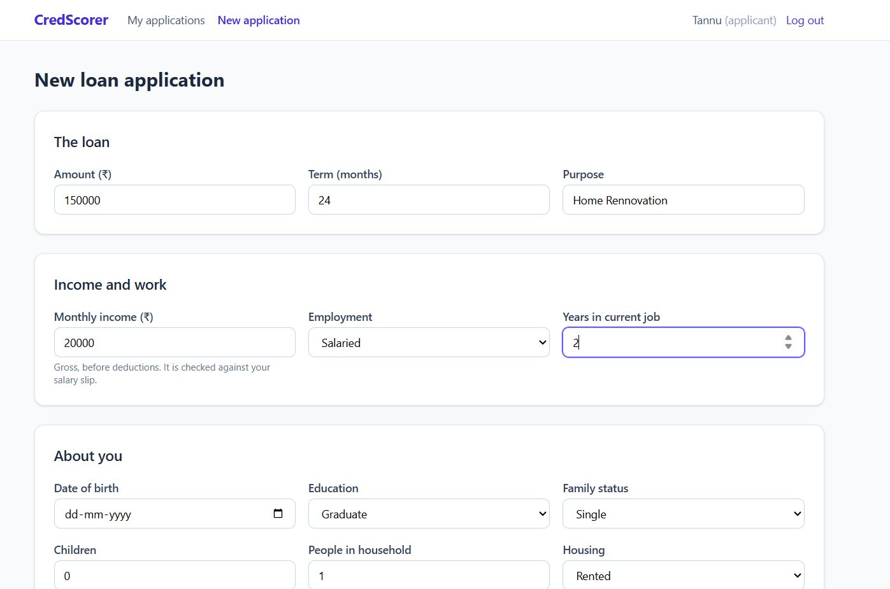
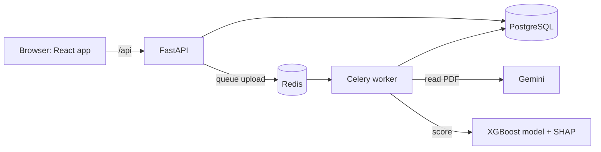
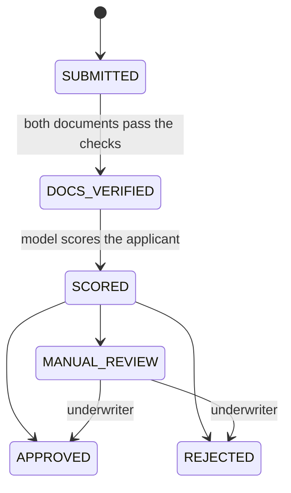
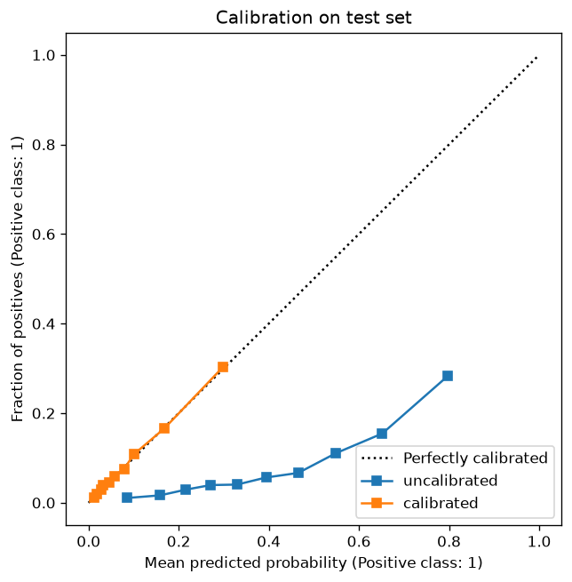
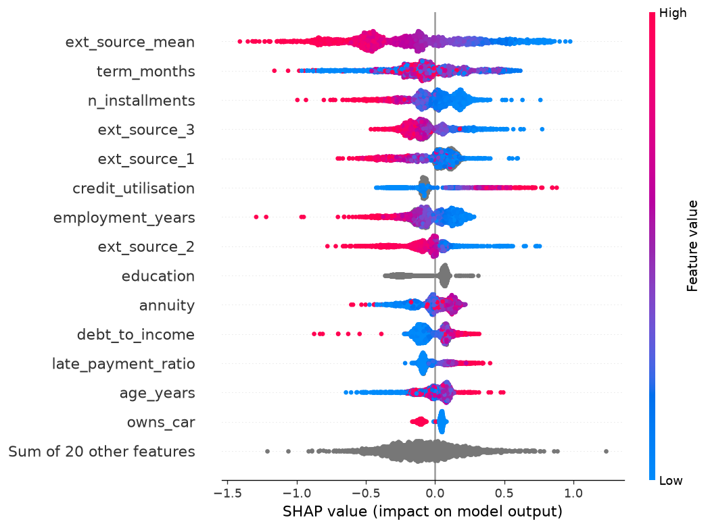
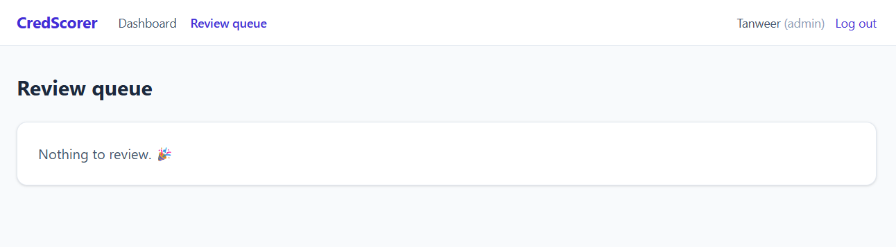
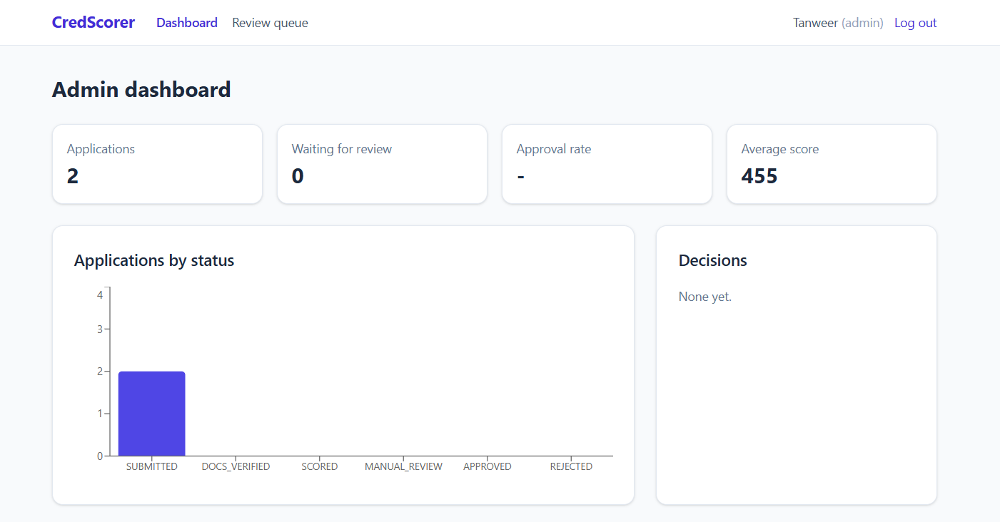

# CredScorer

An end-to-end loan underwriting app. An applicant applies online and uploads a salary slip and a bank statement. Gemini reads the documents and checks them against what the applicant declared. An XGBoost model trained on the Kaggle Home Credit data then scores the applicant, and a rules engine approves, rejects or sends the application to a human underwriter. Every score comes with the reasons behind it.

**Live demo:** https://credscorer.onrender.com (free hosting: the first visit after a quiet spell takes about a minute to wake up)



## What it does

| Who | What they can do |
|---|---|
| **Applicant** | Sign up, apply for a loan, upload documents, watch the application move through each step, see their score with the top reasons and tips, and try "what if" changes (more income, smaller loan, longer term). |
| **Underwriter** | Work through the manual review queue: the score, the top 5 SHAP factors, what Gemini read from each document and which checks failed. Approve or reject, always with a written reason. |
| **Admin** | See live stats, change the decision thresholds without a redeploy, add staff accounts and search the audit log of every change. |

## Architecture



1. An upload is saved and queued, and the API answers at once.
2. The Celery worker sends the PDF to Gemini, which returns structured data (employer, gross and net pay, monthly salary credits and balances).
3. The worker checks the data against the application. When both documents pass, it builds the 34 model features, scores the applicant and runs the decision rules.
4. The React page polls the API and moves forward on its own.

**Locally** this runs as five containers with `docker compose`: postgres, redis, api, worker, and web (nginx serving React and forwarding `/api`).

**Online** it runs on free plans as one container on Render with a Neon PostgreSQL database. Free Render has no background workers, so there the API runs the same extraction task in-process (`RUN_TASKS_INLINE=true`) and also serves the React build.

### Application status flow



Any other transition is refused by the API. A document that fails its checks keeps the application in `SUBMITTED`, so the applicant can upload a better one.

## Tech stack

| Part | Tools |
|---|---|
| Backend | Python 3.13, FastAPI, SQLAlchemy 2, Alembic, Pydantic, JWT auth with roles |
| Jobs | Celery + Redis, with retries |
| Documents | Google Gemini (structured JSON output), rule-based validation |
| Machine learning | XGBoost, Optuna, isotonic calibration, SHAP, MLflow, pandas |
| Frontend | React 19, Vite, Tailwind CSS 4, React Router, Recharts |
| Database | PostgreSQL |
| Deploy | Docker, docker compose, nginx, Render, Neon |
| Tests | pytest (API, rules, validation, scoring, serving) |

## Model card

**Data.** Kaggle [Home Credit Default Risk](https://www.kaggle.com/competitions/home-credit-default-risk): about 307,000 past loans, of which about 8% defaulted. Split into train, calibration and test sets. The test set was never used for training, tuning or calibration.

**Features (34).** Income, loan amount, annuity and term, and their ratios (credit to income, payment to income). Age, years employed, family, housing, education and income type. External credit scores. Repayment history (late payment ratio, days late, underpayments). Bureau debt (active loans, total and overdue debt, debt to income, utilisation) and previous applications. The same feature code is used in training and in the API.

**Training.** XGBoost with class weights and early stopping, tuned with Optuna on validation ROC-AUC, then calibrated with isotonic regression on a separate set so the output is a real probability of default (PD). Runs are logged in MLflow.

**Results on the test set:**

| Metric | Uncalibrated | Calibrated |
|---|---|---|
| ROC-AUC | 0.769 | 0.768 |
| PR-AUC (base rate 8%) | 0.262 | 0.253 |
| KS | 0.414 | 0.403 |
| Brier score | 0.185 | 0.067 |
| Mean predicted PD | 39.2% | 7.98% |
| Actual default rate | 8.07% | 8.07% |

Calibration is what makes the PD usable. Before it, the class weights push the average prediction to 39%. After it, the average is 7.98% against a real rate of 8.07%.

| Calibration | What drives the score (SHAP) |
|---|---|
|  |  |

**From PD to score.** A standard bank scorecard: 600 points at 50:1 good-to-bad odds, and every 40 extra points doubles the odds. PD is floored at 0.1%, so the best possible score is about 773.

**Explanations.** Each score stores its top SHAP factors, shown to the applicant in plain words and to the underwriter as a chart. Isotonic calibration keeps the order of the scores, so the ranking of reasons stays valid.

**Fairness.** Gender is not used as a feature. Age, family status and number of children still are, as in the source data. A real lender would need a fair-lending review of these before using the model.

**Limits.** The model is trained on one lender's historical customers from another country, and credit bureau data is simulated from Kaggle rows that were not used for training. It is a portfolio project and must not be used for real lending decisions.

## Decision rules

The rules sit on top of the model and are plain Python, so they are easy to test and explain:

- Score below the reject threshold: **rejected**.
- Score at or above the approve threshold, documents verified and EMI at most 50% of monthly income: **approved**.
- Anything else, including a high score with an unaffordable EMI: **manual review**.

The starting thresholds come from the score distribution on validation data (`ml/analyze.py`). An admin can change them in the app, and the change is written to the audit log.

## Document checks

Gemini returns structured data, and the app checks it against the application. Each problem lowers a confidence score that starts at 1.0, and a document passes at 0.7 or above.

- **Salary slip:** employer present, gross or net pay found, net not above gross, gross within 15% of the declared income.
- **Bank statement:** at least 3 months, salary credits found, average credit between 70% and 115% of declared income, no overdrawn months.
- **Both:** the name on the document matches the applicant, and the document is the type that was asked for.

Gemini calls retry up to 3 times. The underwriter sees every issue that was found.

## Run it locally

You need Docker Desktop and a Gemini API key.

1. Create `backend/.env`:
   ```
   GEMINI_API_KEY=your-key
   GEMINI_MODEL=gemini-3.8-flash
   JWT_SECRET=any-long-random-string
   ```
2. Start everything from the project folder:
   ```
   docker compose up -d --build
   ```
3. Create an admin account:
   ```
   docker compose exec api python create_admin.py
   ```
4. Open http://localhost:8080. The API health check is at http://localhost:8080/api/health.

`ml/artifacts/` already holds the trained model. Retraining and seeding the simulated bureau need the Kaggle data in `ml/data/raw/` (see `ml/prepare_data.py`, `ml/train.py` and `backend/seed_bureau.py`). Without bureau data, every applicant is scored as a "thin file" applicant with no credit history.

## API overview

| Method and path | Who | What |
|---|---|---|
| `POST /auth/signup`, `POST /auth/login`, `GET /auth/me` | anyone | Accounts and JWT login |
| `POST /auth/staff` | admin | Create an underwriter or admin |
| `POST /applications`, `GET /applications`, `GET/PATCH /applications/{id}` | applicant | Applications |
| `POST /applications/{id}/documents`, `GET .../documents` | applicant | Upload a PDF (max 5 MB), list documents |
| `GET /applications/{id}/documents/{doc}/extraction` | owner, staff | What Gemini read and the checks |
| `POST/GET /applications/{id}/score` | owner, staff | Score, PD, band and reasons |
| `POST /applications/{id}/what-if` | owner, staff | Score with changed income, amount, term or employment |
| `GET /applications/{id}/decision` | owner, staff | The latest decision |
| `GET /underwriter/queue`, `GET /underwriter/applications/{id}`, `POST .../decision` | underwriter | Review queue and manual decisions |
| `GET/PUT /admin/thresholds`, `GET /admin/stats`, `GET /admin/audit-logs` | admin | Settings, stats and the audit log |

Interactive API docs (Swagger) are at http://localhost:8000/docs when running locally. Online, every path starts with `/api`.

## Screenshots

| Underwriter review | Admin dashboard |
|---|---|
|  |  |

## Project layout

```
backend/    FastAPI app (auth, applications, documents, scoring, decisions, admin), Alembic migrations, tests
ml/         Feature code, training, calibration, SHAP analysis, model artifacts
frontend/   React app for the three portals
Dockerfile  All-in-one image for the free online deploy
docker-compose.yml  Local stack: postgres, redis, api, worker, web
```

---

Built by [Tanweer](https://github.com/Tanweer076).
